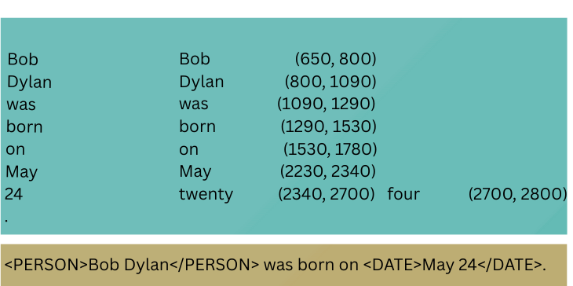
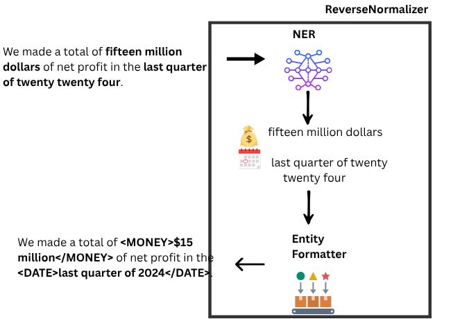
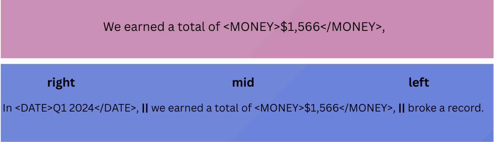
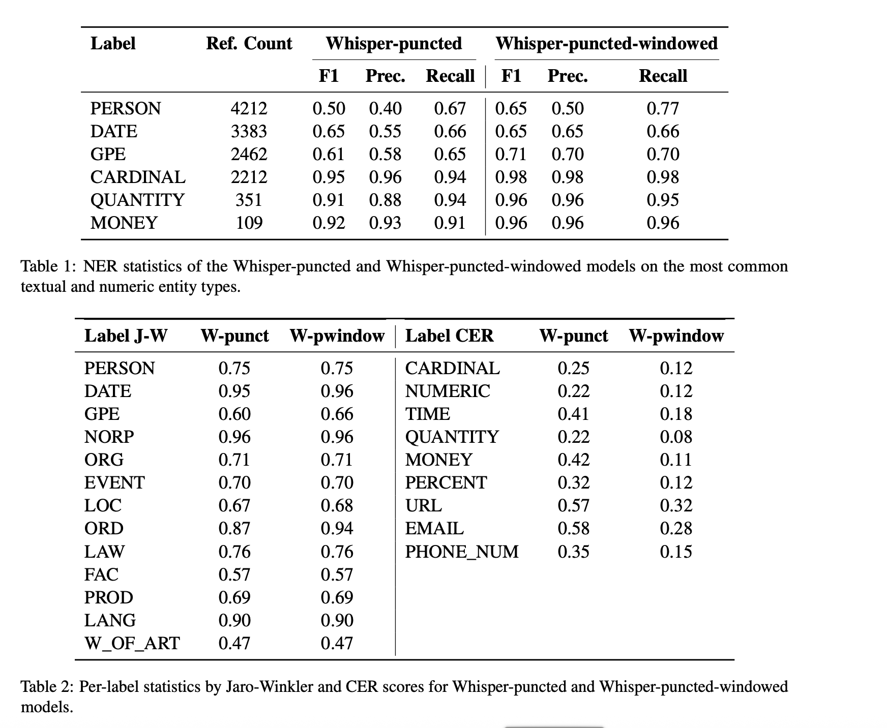

# Mind the Gap: Entity-Preserved Context-Aware ASR for Structured Transcriptions

This is the repo for TSD2025 conference paper "Mind the Gap: Entity-Preserved Context-Aware ASR for Structured Transcriptions".

We propose a novel training approach that extends the semantic context of ASR models by adding overlapping context windows during training. By sliding 5-second overlaps on both sides of 30-second chunks, we create a 40-second "effective semantic window," improving entity recognition and formatting while focusing predictions on the central 30 seconds. To address entities spanning chunk boundaries, we reassign such entities entirely to the right-hand chunk, ensuring proper formatting. Additionally, enriched training data with embedded entity labels enables the model to learn both recognition and type-specific formatting. Evaluated on the Spoken Wikipedia dataset, our method improves performance across semantic tasks, including named entity recognition (NER) and entity formatting. These results highlight the effectiveness of context-aware training in addressing ASR limitations for long-form transcription and complex entity recognition tasks. Overall we offer an innovative approach to long-audio ASR and bringing semantics to ASR. The paper can be found as [conference publication](https://dl.acm.org/doi/10.1007/978-3-032-02548-7_22).

## Data preparation
We worked on SpokenWikipedia dataset,chosen for its long-audio and rich set of entity types and formats. The data came in aligned version and multiword entities are given by the XML format, so we processed **whole** transcripts such that they include entity tags like this:

</img>

Though multiword entities are provided by the dataset format, still we needed to extract single-word entities , also all the entity types. The below diagram shows the outline of burying entity tags to the transcript:

</img>

This pipeline is called the **ReverseNormalizer**, consisting of two modules, first one is **NER** to tag the entities with their types; the second module is called **EntityFormatter** which formats entities according to their types, calculates entity boundaries and inserts the tags into the transcript text.

## Preparing the semantic windows
Our work introduces the idea of learning the semantic windows. For each 40 seconds of audio, we mark 5secs of left and right context windows with Whisper special tokens. Just like this:

</img>

Then we learn the mid-window and use surrounding window audio-transcript pair as semantic context, this way though we output a window of 30seconds audio, we indeed went up to an efficient 40 seconds of context. The paper include all the details about the loss function.

## Inference

For the inference we mutated Whisper's HF implementation pipeline. The original implementation includes sliding an audio window of 5seconds then employing some longest matching substring algorithm. Our approach is `window-native` , the inference recognizes window boundaries directly by boundary tags.

## Results

Results proves effectiveness of our windowing approach:

</img>

All the experiments were done on TPU with Flax and HF lib.
